# Производство в maERP: дашборд и рабочее место

Статья базы знаний tinycio по продукту maERP. Раздел: «Производство».
Аудитория: оператор производства, менеджер по производству, руководитель.
Версия конфигурации: 2.0.15.50 и выше.

---

## 1. Что это за механизм

В maERP производство ведётся **от заказа клиента**, а не от отдельного «производственного
задания». Один документ — «Заказ клиента на производство» — держит на себе всю цепочку:
из чего делаем (материалы по технологической карте), что закупить, что отдать переработчику,
что выпустить и что отгрузить.

Вокруг этого заказа работают два экрана:

| Экран | Для чего | Кто смотрит |
|---|---|---|
| **Производственный дашборд** | быстрый ответ «как идут дела в цеху сегодня» — цифры и диаграммы за 30 дней | руководитель, администратор, оператор производства |
| **Рабочее место производства** | ежедневная работа: очередь заказов и ввод всех документов цепочки прямо в строках таблиц | оператор производства, менеджер |

Ключевая идея рабочего места: **оператор не открывает формы документов**. Он вводит строку
в таблицу нужной закладки, и система сама создаёт, заполняет и проводит документ —
заказ поставщику, поступление, передачу в переработку, выпуск или отгрузку.

---

## 2. Как открыть

**Производственный дашборд.** Начальная страница программы. У всех ролей, кроме оператора
производства, дашборд открывается сразу при входе. Внутри — закладки «Сток», «Продажи»,
«Производство»; закладка «Производство» видна администратору и оператору производства.
Отдельно дашборд открывается командой в главном меню.

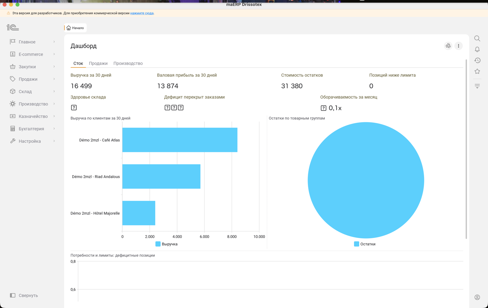

*Начальная страница. Дашборд открыт на закладке «Сток»; закладка «Производство» — третья.*

**Рабочее место производства.** Раздел **«Производство»** → команда **«Рабочее место
производства»**. У роли «Оператор производства» рабочее место выведено на начальную
страницу: оператор входит в программу и сразу видит очередь заказов.

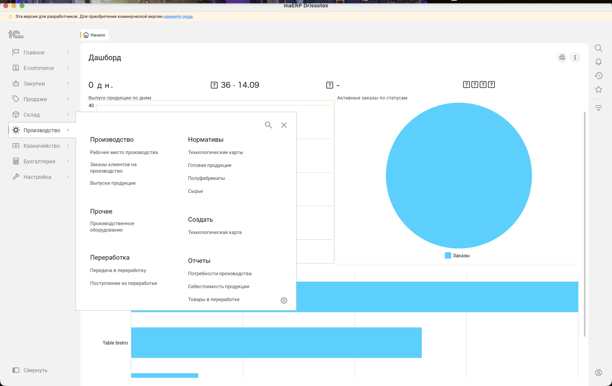

*Меню раздела «Производство»: рабочее место, заказы клиентов на производство, выпуски,
нормативы (технологические карты), переработка и отчёты.*

---

## 3. Производственный дашборд

Дашборд **только показывает** — ввода и расшифровок на нём нет. Данные пересчитываются при
открытии формы и по кнопке **«Обновить»**.

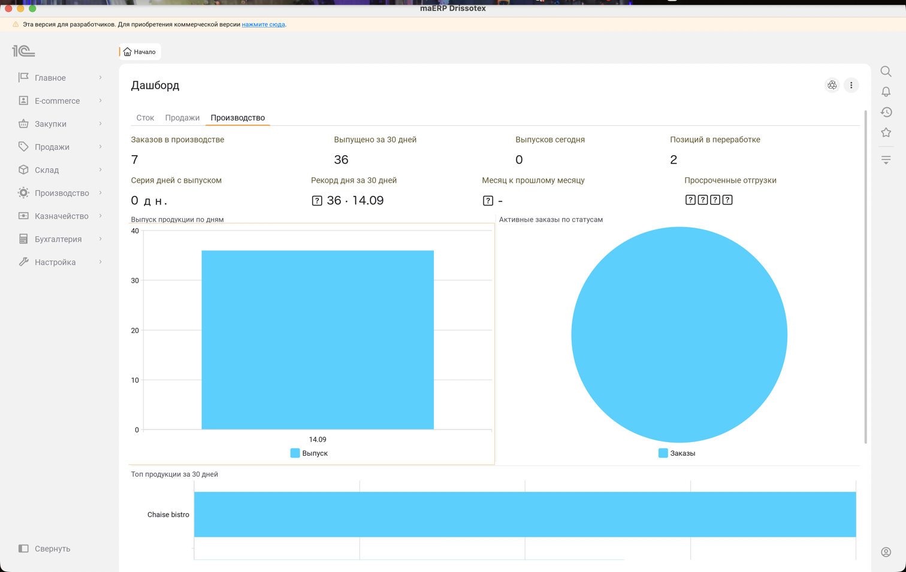

*Закладка «Производство»: верхняя строка — показатели, вторая — достижения, ниже — диаграммы.*

### 3.1. Показатели

| Показатель | Что считает |
|---|---|
| **Заказов в производстве** | сколько заказов клиентов сейчас в работе — на стадиях от «Формируется потребность» до «Получен от субподрядчика» |
| **Выпущено за 30 дней** | суммарное количество готовой продукции по проведённым выпускам за последние 30 дней |
| **Выпусков сегодня** | сколько документов выпуска проведено с начала сегодняшнего дня |
| **Позиций в переработке** | сколько разных номенклатурных позиций сейчас лежит на балансе у переработчиков |

### 3.2. Достижения

Блок сделан «в игровой логике» — чтобы цех видел свой темп, а не только абсолютные цифры.

| Показатель | Что считает | Как показывается |
|---|---|---|
| **Серия дней с выпуском** | сколько дней подряд был выпуск | значок 🔥 при серии от трёх дней; сегодняшний день серию не рвёт, пока не закончился |
| **Рекорд дня за 30 дней** | лучший день по количеству выпуска и его дата | 🏆 число и дата |
| **Месяц к прошлому месяцу** | выпуск текущего месяца к выпуску прошлого, в процентах | шкала из символов ▓░, процент, 🚀 при 100 % и выше |
| **Просроченные отгрузки** | сколько активных заказов, у которых дата отгрузки уже прошла | ✅ при нуле, ⚠ с числом при просрочке |

### 3.3. Диаграммы

- **«Выпуск продукции по дням»** — гистограмма за 30 дней, по оси X дни в формате `дд.ММ`.
- **«Активные заказы по статусам»** — круговая: сколько заказов на каждой стадии; завершённые
  заказы в неё не попадают.
- **«Топ продукции за 30 дней»** — горизонтальная гистограмма, пять позиций с наибольшим выпуском.

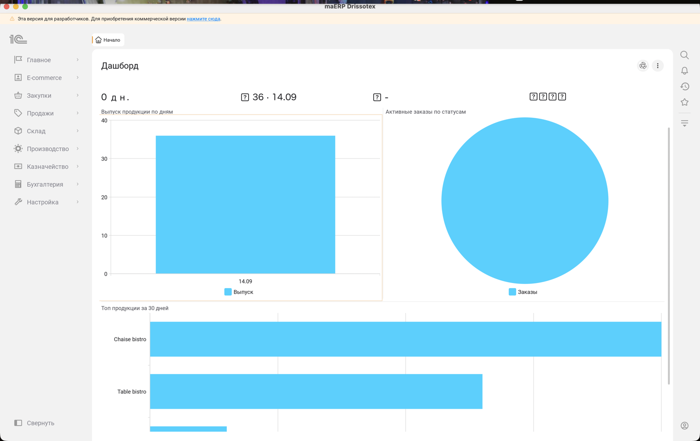

*Прокрутка вниз: «Выпуск продукции по дням», «Активные заказы по статусам» и «Топ продукции
за 30 дней».*

### 3.4. Чего на дашборде нет

Отбора по периоду, организации или складу нет — период зафиксирован (30 дней и текущий день),
данные берутся по всей базе. Клик по диаграмме ничего не открывает. Если нужен разрез по
заказу — это отчёт «Потребности производства» и рабочее место.

---

## 4. Рабочее место производства: раскладка

Окно делится на три части:

1. **Закладка «Фильтры»** — что показывать в очереди.
2. **Верхние закладки «Заказы» и «Продукция»** — очередь заказов и строки продукции.
3. **Нижние закладки** — документы по выбранному заказу: «Материалы», «Заказы поставщику»,
   «Поступления», «Выпуск», «Отгрузки», «Переработка», «Поступления из переработки», «Документы».

Нижние закладки всегда относятся к **текущему заказу** верхней таблицы. Переставили курсор
на другой заказ — нижние таблицы перечитались.

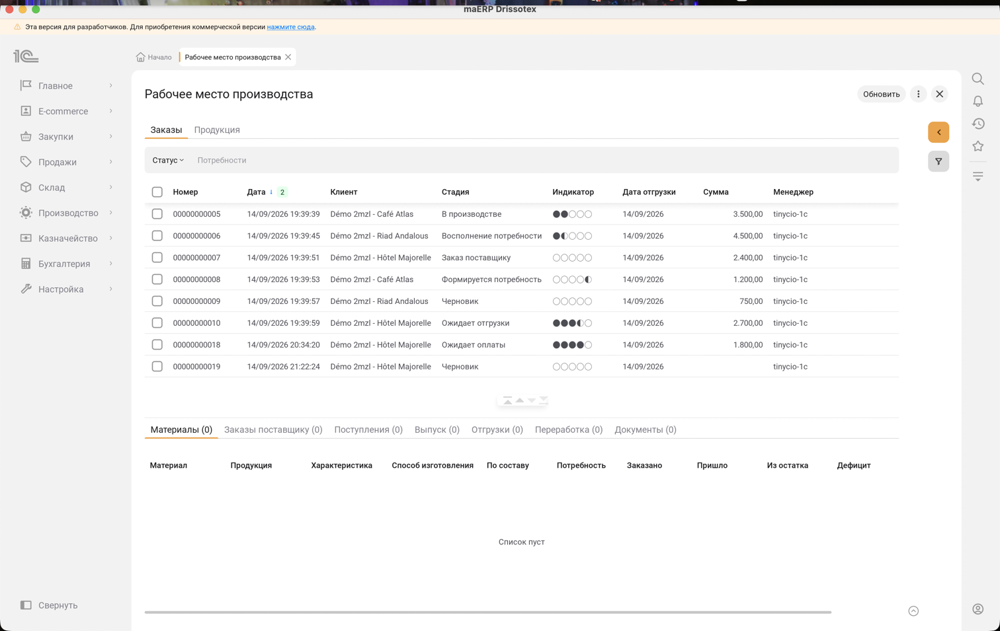

*Очередь заказов на производство. В скобках у каждой нижней закладки — число строк по
выбранному заказу.*

### 4.1. Фильтры

| Поле | Что делает |
|---|---|
| **Заказы** (тумблер) | **«Производство»** — только заказы на производство (по умолчанию); **«Все»** — вместе с заказами-продажами |
| **Клиент** | поиск по вхождению текста в наименование контрагента |
| **Продукция** | поиск по вхождению текста в наименование номенклатуры |

В таблицу «Продукция» попадают строки последних 300 заказов; когда заказов больше, программа
сообщает: *«Показаны строки последних 300 заказов.»* — сузьте отбор.

---

## 5. Закладка «Заказы»

Список заказов, только для чтения. Колонки: **Номер, Дата, Клиент, Стадия, Индикатор,
Дата отгрузки, Сумма, Менеджер**. Колонка «Сумма» скрыта у роли «Оператор производства».

### 5.1. Стадия

Стадию **никто не ставит руками** — она пересчитывается сама по данным контура: проведён ли
заказ, есть ли потребность в материалах, закрыта ли она закупкой, что выпущено, отгружено и
оплачено. Порядок стадий:

| Стадия | Когда наступает |
|---|---|
| **Черновик** | заказ не проведён или помечен на удаление |
| **Формируется потребность** | заказ проведён, но материалы в нём не заданы |
| **Заказ поставщику** | по какому-то материалу заказано поставщику меньше потребности |
| **Восполнение потребности** | заказано всё, но пришло меньше потребности |
| **В производстве** | материалы есть, выпущено меньше заказанного |
| **Передан субподрядчику** / **Получен от субподрядчика** | стадии схемы с переработчиком |
| **Ожидает отгрузки** | выпущено всё, отгружено меньше заказанного |
| **Ожидает оплаты** | отгружено всё, за заказом числится долг |
| **Выполнен** | долга нет, цепочка закрыта |

Отмена проведения любого документа цепочки возвращает стадию назад: стадия всегда равна
расчёту по текущим данным.

### 5.2. Индикатор

Пять кружков — пять долей выполнения заказа:

**обеспечение материалами · поступление материалов · выпуск · отгрузка · оплата**

- `○` — не начато,
- `◐` — частично,
- `●` — полностью.

Подсказка колонки показывает те же пять долей в процентах. Индикатор удобнее стадии тем, что
стадия называет только «самое раннее незакрытое звено», а кружки показывают всю картину сразу:
заказ может быть «в производстве» и при этом уже наполовину отгружен.

Двойной щелчок по номеру заказа открывает его форму — там та же стадия и тот же индикатор:

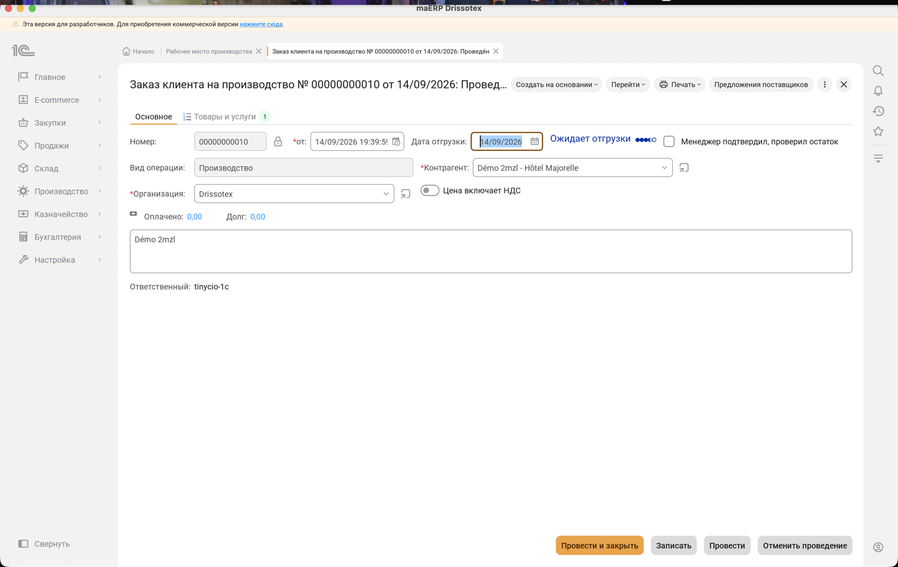

*Закладка «Основное» заказа: вид операции «Производство», справа от даты отгрузки — стадия
и индикатор. Строки продукции — на закладке «Товары и услуги».*

---

## 6. Закладка «Продукция»: заказы вводятся здесь

Это единственное место контура, где **создаётся сам заказ**. Колонки: **Статус, Стадия,
Индикатор, Клиент, Продукция, Характеристика, Количество, Упаковка, Цена, Сумма,
Дата отгрузки, Менеджер, Заказ на производство**.

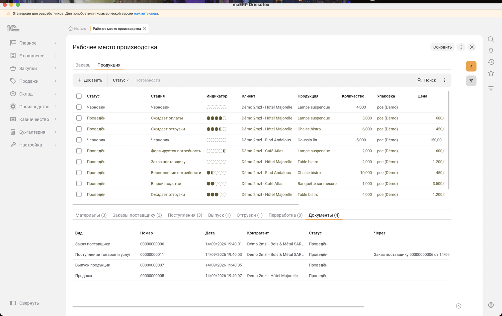

*Строки продукции всех заказов очереди: у каждой своя стадия и свой индикатор. Кнопка
«Добавить» заводит новую строку — и, если нужно, новый заказ.*

### 6.1. Как завести заказ

1. Добавьте строку — она встаёт в начало таблицы со статусом **«Не записано»**.
2. Укажите **Клиента**, **Продукцию** и **Количество**. По первой строке клиента система
   создаёт **черновик заказа** на производство и записывает в него строку.
3. Следующая строка того же клиента попадает **в тот же черновик**.
4. Чтобы положить строку в другой заказ, откройте выбор в колонке **«Заказ на производство»**:
   в списке — пункт **«Новый заказ»** и черновики этого клиента, представленные по-человечески
   (номер, дата, контрагент и сумма; у ролей без прав на суммы — количество).

Материалы строки заполняются по технологической карте автоматически — открывать заказ для
этого не нужно.

**Подбор номенклатуры.** В колонке «Продукция» предлагается только готовая продукция и
полуфабрикаты, списком без групп; кнопка выбора сначала показывает 10 последних созданных
позиций. Если нужной позиции нет — проверьте тип номенклатуры в её карточке.

### 6.2. Если строка не записалась

Неполная строка не записывается, статус остаётся «Не записано», и программа говорит, чего
не хватает:

> Строка не записана: укажите клиента, продукцию и количество.

### 6.3. Заказ в работе

Строки проведённого заказа не редактируются:

> Заказ в работе: чтобы изменить строки, верните его в черновик кнопкой «Статус» или откройте форму заказа.

Строки заказов-продаж в рабочем месте тоже не правятся:

> Это не заказ на производство: строки продаж меняются в форме заказа.

---

## 7. Кнопка «Статус»

Подменю над обеими верхними таблицами, работает по **выделенным строкам**:

| Пункт | Что делает |
|---|---|
| **В работу** | проводит заказ. После этого по нему можно вводить документы цепочки |
| **В черновик** | отменяет проведение — строки снова редактируются |
| **Отменить** | помечает заказ на удаление (программа спросит подтверждение) |

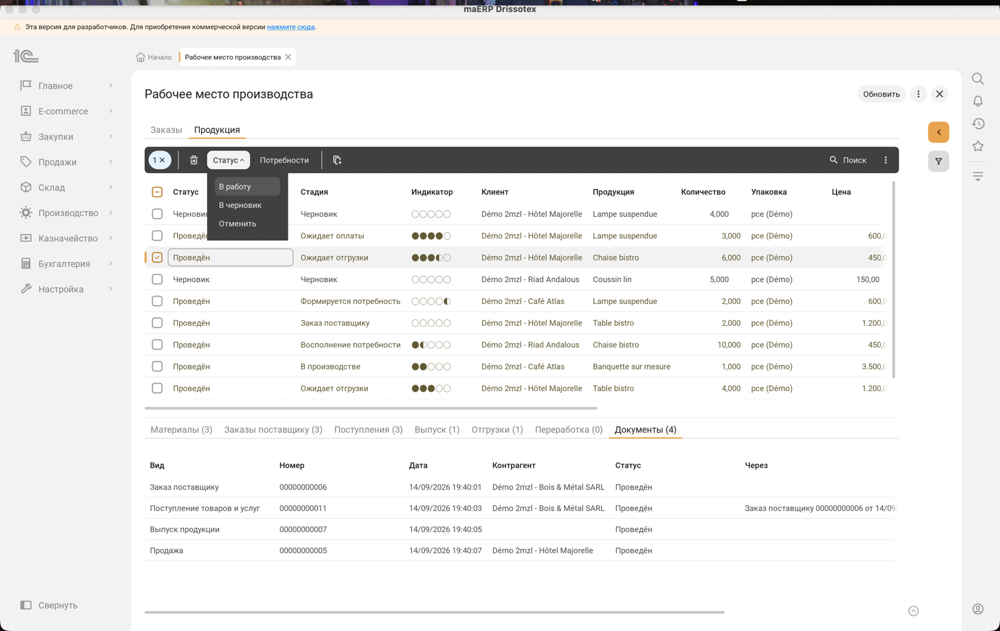

*Пункты меню становятся доступны, когда отмечена хотя бы одна строка: слева в панели видно
число отмеченных.*

Отказ по одному заказу не прерывает обработку остальных — в сообщениях видно, по какому
заказу что не прошло.

Такое же подменю (**Провести / В черновик / Отменить**) есть на каждой нижней закладке — оно
действует на документы отмеченных строк.

Рядом — кнопка **«Потребности»**: отчёт «Потребности производства» с отбором по текущему заказу.

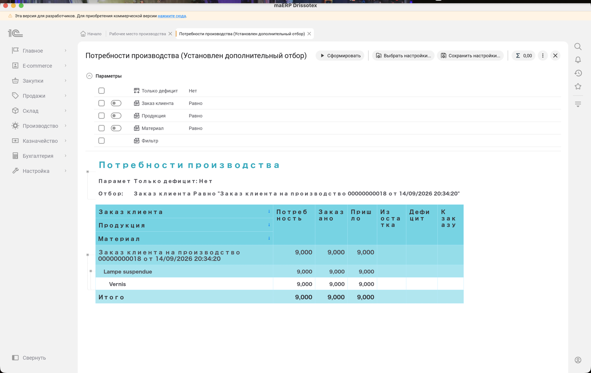

*Отчёт открывается с уже установленным отбором по заказу: группировки заказ → продукция →
материал, ресурсы «Потребность», «Заказано», «Пришло», «Из остатка», «Дефицит», «К заказу».*

---

## 8. Нижние закладки: ввод документов строками

### Общие правила

- Документы вводятся **только по проведённому заказу**:
  > Документы вводятся только по заказу на производство в работе.
- После окончания редактирования строки документ **создаётся и сразу проводится**. Если
  проведение не прошло (не хватило материалов, закрыт период), документ остаётся записанным
  непроведённым, а в колонке «Статус» видно состояние и причина.
- **Колонка «Документ»** в строке определяет, в какой документ попадёт строка. Новая строка
  по умолчанию идёт в документ соседней записанной строки с тем же контрагентом, если он
  сегодняшний; иначе выберите **«Новый документ»**:
  > Новая строка добавляется только в документ за сегодня: выберите «Новый документ».
- Правка строки перепроводит документ, удаление строки убирает её из документа, документ без
  строк помечается на удаление.

### 8.1. «Материалы» — что нужно и чего не хватает

Только чтение. Показывает потребность заказа и то, как она закрывается:
**Материал, Продукция, Характеристика, Способ изготовления, По составу, Потребность, Заказано,
Пришло, Из остатка, Дефицит, К поступлению**.

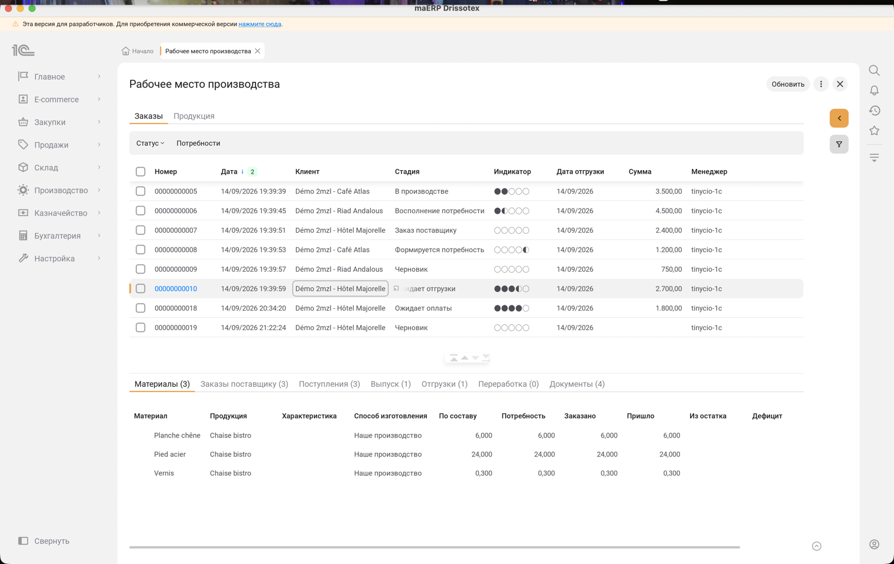

*Потребность заказа по каждому материалу и то, как она закрыта: заказано, пришло, из остатка,
дефицит.*

Это главная аналитическая таблица оператора: «Дефицит» — что ещё не заказано, «К поступлению» —
что заказано, но не пришло. Материалы разворачиваются по уровням: полуфабрикат, который делает
переработчик или который закупается, остаётся отдельной позицией со своей потребностью.

### 8.2. «Заказы поставщику»

Колонки: **Статус, Поставщик, Материал, Характеристика, Количество, Упаковка, Цена, Сумма,
Продукция, Дата поставки, Документ**.

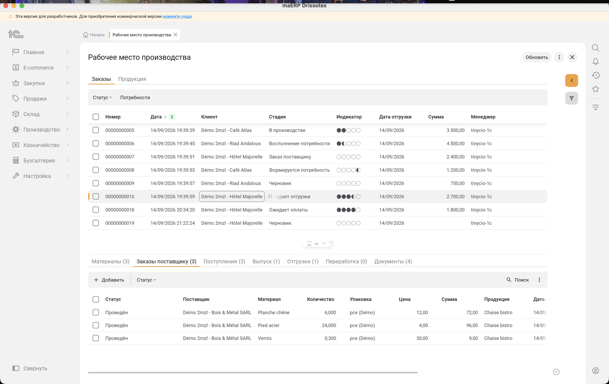

*Каждая строка — строка заказа поставщику. Кнопка «Добавить» заводит новую, «Статус» —
проводит или отменяет документы отмеченных строк.*

Строка создаёт заказ поставщику на основании заказа на производство. В колонке «Материал»
предлагаются сырьё, полуфабрикаты и товары; кнопка выбора начинает с материалов текущего
заказа и показывает рядом, сколько каждого не хватает.

> Строка не записана: укажите поставщика, материал и количество.

У роли «Оператор производства» заказ поставщику доступен только на чтение — закупка остаётся
за менеджером по закупкам.

### 8.3. «Поступления»

Колонки: **Статус, Поставщик, Номер накладной, Дата накладной, Материал, Характеристика,
Количество, Упаковка, Цена, Сумма, Заказ поставщику, Документ**.

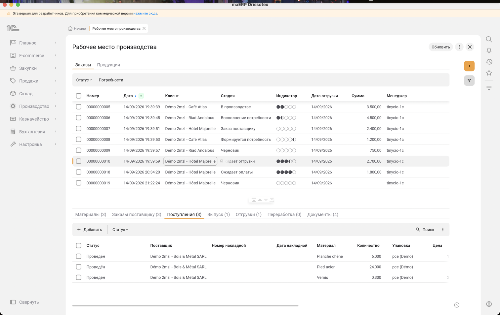

*Колонки «Номер накладной» и «Дата накладной» — реквизиты документа поставщика, они
заполняются прямо в строке.*

Строка создаёт поступление товаров и услуг по заказу на производство и связанному заказу
поставщику. Номер и дата накладной поставщика вводятся прямо в строке — отдельно открывать
документ не нужно.

> Строка не записана: укажите поставщика, материал и количество.

Если по материалу несколько строк заказов поставщику, программа попросит выбрать нужную:
> Выберите строку заказа поставщику, по которой пришёл материал.

### 8.4. «Переработка» — передача давальцу

Колонки: **Статус, Переработчик, Материал, Характеристика, Количество, Упаковка, Склад,
Поступления из переработки, Документ**.

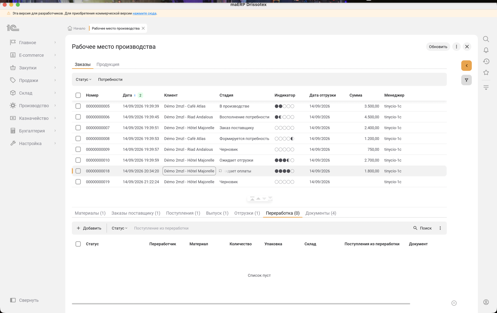

*Закладка переработки у заказа, по которому передач ещё не было. Кнопка «Поступление из
переработки» вводит приёмку по отмеченной передаче.*

Строка создаёт передачу в переработку на основании заказа. Контрагент должен быть помечен как
субподрядчик:
> Контрагент не помечен как субподрядчик (переработчик): выберите переработчика.

> Строка не записана: укажите переработчика, материал и количество.

Если по техкарте передаётся полуфабрикат, он **выпускается автоматически в момент передачи** —
отдельный документ выпуска оператор не вводит.

### 8.5. «Поступления из переработки»

Колонки: **Статус, Передача, Переработчик, Продукция, Характеристика, Количество, Упаковка,
Потери, %, Услуги, Склад, Документ**. Есть кнопки **«Поступление из переработки»** и
**«+ услуга переработки»**.

Поступление вводится **по проведённой передаче**:
> Поступление вводится только по проведённой передаче в переработку.

Документ списывает переданное переработчику сырьё и приходует продукцию с правильной
себестоимостью; услуги переработчика входят в себестоимость принятой продукции. Процент потерь
задаётся в строке. Принять больше ожидаемого нельзя:
> Больше ожидаемого по передаче: можно принять ещё %1.

### 8.6. «Выпуск»

Колонки: **Статус, Продукция, Характеристика, Количество, Упаковка, Склад, Через, Документ**.

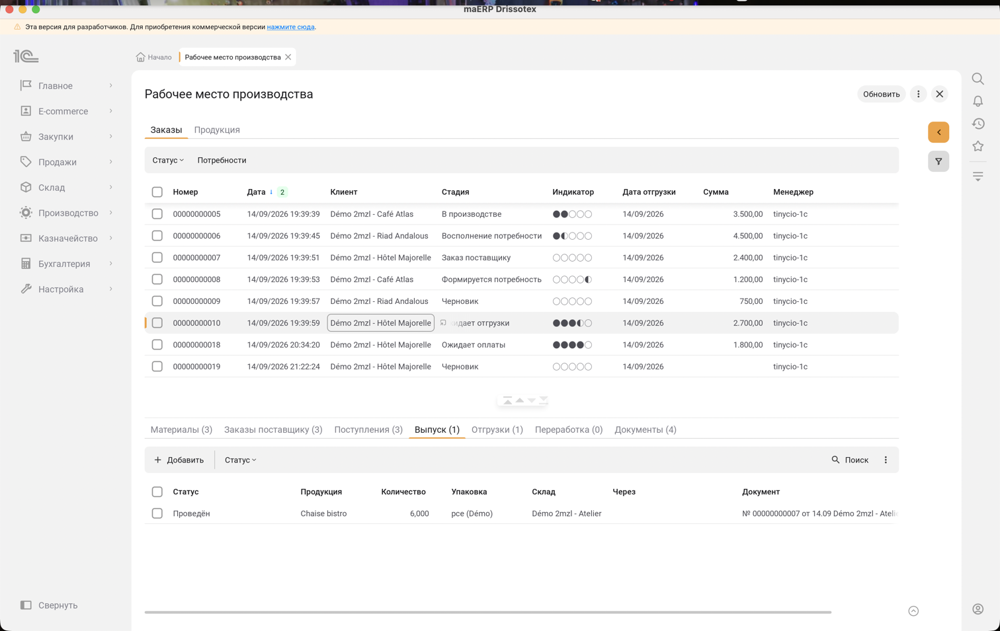

*Выпуск, введённый по заказу вручную: колонка «Через» пуста.*

Строка создаёт документ выпуска продукции с основанием-заказом; материалы списываются по
технологической карте на дату выпуска. Колонка **«Через»** заполнена у автоматических
выпусков — в ней виден документ, который их породил (реализация или передача в переработку).

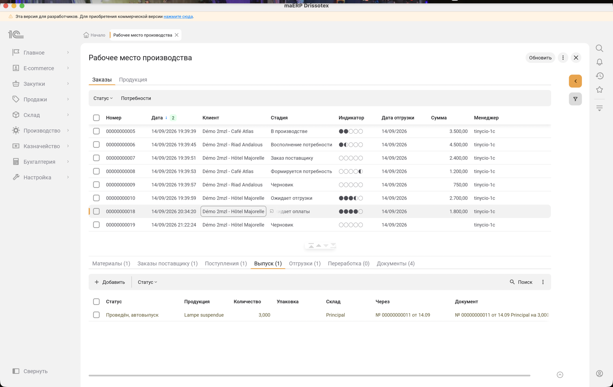

*Тот же список у заказа, продукция которого выпущена автоматически при отгрузке: статус
«Проведён, автовыпуск», в колонке «Через» — номер и дата продажи.*

**Автовыпуски правятся только через своё основание:**
> Автовыпуск меняется только проведением своего документа-основания: правьте строки основания.

Если карты на дату нет:
> Нет технологической карты на дату выпуска: %1. Такой выпуск вводится в форме документа.

### 8.7. «Отгрузки»

Колонки: **Статус, Продукция, Характеристика, Количество, Упаковка, Цена, Сумма, Автовыпуск,
Документ**.

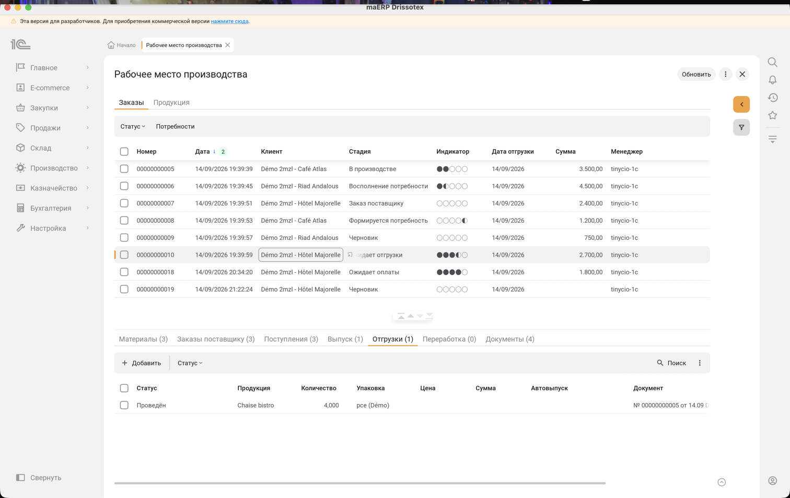

*Отгрузка по заказу. В колонке «Автовыпуск» отмечены строки, по которым выпуск создан
автоматически.*

Строка создаёт реализацию на основании заказа. Если включена настройка автовыпуска при
отгрузке, проведение реализации **само создаёт и проводит выпуск** на отгружаемую продукцию:
материалы списываются по составу заказа, по возможности из партий закупок под этот же заказ.
В колонке «Автовыпуск» видно, что выпуск создан автоматически.

Так работает схема для производств, где производственные документы вводить некому: оператор
оформляет отгрузку, а выпуск и списание материалов система делает сама.

### 8.8. «Документы»

Только чтение, сводка по заказу: **Вид, Номер, Дата, Контрагент, Статус, Через, Сумма,
Продукция, Материалы**. Двойной щелчок открывает форму документа.

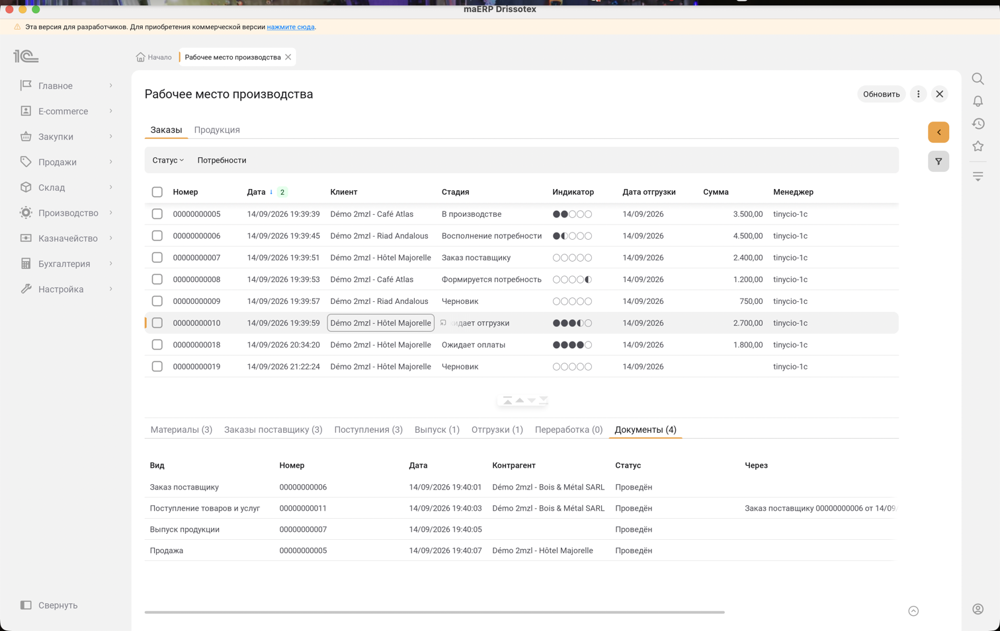

*Вся цепочка по заказу в порядке появления: заказ поставщику → поступление → выпуск → продажа.*

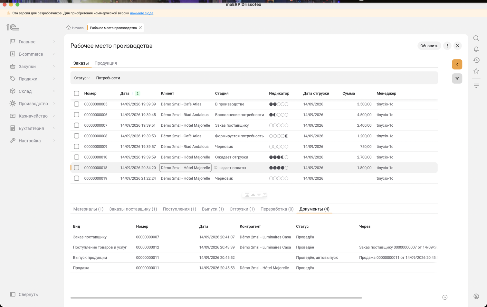

*У заказа с автовыпуском выпуск помечен «Проведён, автовыпуск», а в колонке «Через» стоит
продажа, которая его породила.*

---

## 9. Что рабочее место не правит

Часть документов открывается только в своей форме — программа об этом прямо сообщает:

| Сообщение | Что делать |
|---|---|
| *Эту строку правьте в форме документа: у неё серии или у документа данные, которых рабочее место не меняет.* | откройте документ двойным щелчком |
| *У документа есть услуги, доп. расходы, зачёт авансов или он завершён: правьте его в форме документа.* | то же |
| *Сырьё поступления правили вручную: правьте его в форме документа («Рассчитать сырьё» вернёт расчёт).* | ручной расчёт сырья сохраняется, рабочее место его не перетирает |
| *Заказ изменён другим пользователем: таблица перечитана, повторите правку.* | ваша правка не потерялась и не затёрла чужую — повторите ввод |

---

## 10. Сквозной сценарий: от заказа до оплаты

1. **Заказ.** Закладка «Продукция» → строка: клиент, продукция, количество → создан черновик.
   Материалы подставились по техкарте.
2. **В работу.** Кнопка «Статус» → «В работу». Заказ проведён, сформирована потребность в
   материалах. Стадия: «Заказ поставщику».
3. **Закупка.** Закладка «Материалы» показывает дефицит → закладка «Заказы поставщику»:
   строки на недостающее. Стадия: «Восполнение потребности».
4. **Приёмка.** Закладка «Поступления»: строки с номером и датой накладной поставщика.
   Индикатор: второй кружок закрывается.
5. **Переработка** (если часть работ снаружи). «Переработка» → передача; полуфабрикат
   выпускается автоматически. Обратно — «Поступления из переработки».
6. **Выпуск.** Либо строкой на закладке «Выпуск», либо автоматически при отгрузке.
7. **Отгрузка.** Закладка «Отгрузки» → реализация. Стадия: «Ожидает оплаты».
8. **Оплата.** Приходный кассовый ордер или поступление на счёт гасит долг. Стадия: «Выполнен»,
   индикатор `●●●●●`.

---

## 11. Права и суммы

Роль **«Оператор производства»** не видит цены и суммы: колонки «Цена» и «Сумма» скрыты,
а в представлении заказов вместо суммы показывается количество. Кнопки ввода документов
скрываются, если у роли нет права на добавление соответствующего документа:

> Нет права вводить эти документы: строки только для просмотра.

---

## Приложение. О скриншотах

Снимки сделаны 2026-09-23 на демо-данных набора «Démo 2mzl» (`scripts/fixtures.sh --demo`),
конфигурация 2.0.15.x, клиент запущен с русским интерфейсом (`/L ru`). Снималось развёрнутое
окно 1С, у каждого кадра своя подпись. Файлы — `docs/kb/img/`.

**Что нужно поправить до публикации в прод tinycio:**

1. **Организация в кадре называется «Drissotex»** (видно на форме заказа, кадр
   `15-order-form-main.png`) — имя базы клиента. Для публичной статьи организацию в
   демо-базе надо переименовать и кадр переснять.
2. **Заголовок окна — «maERP Drissotex»** по той же причине; он виден на всех кадрах.
3. **Эмодзи в блоке достижений не рисуются** — вместо 🔥/🏆/🚀/✅/⚠ на macOS выводятся
   символы-заглушки (`?`). Видно на кадрах `02` и `03`.
4. **Демо-набор датирован 14.09**, поэтому «Выпусков сегодня» и «Серия дней с выпуском» —
   нули, а «Месяц к прошлому месяцу» пуст. Для красивого кадра дашборда демо-набор нужно
   перегенерировать текущим днём.
5. **Переработка не показана на данных**: в демо-наборе передачи в переработку заведены на
   заказы-продажи, а не на заказы на производство, поэтому закладка «Переработка» снята
   пустой. Кадра «Поступления из переработки» с данными нет — эту закладку показывает
   кнопка на закладке «Переработка».
6. **Кадра ввода новой строки нет**: строки вводятся в рабочую базу, а демо-набор
   идемпотентен — отдельный кадр «создание черновика» снимается вручную.
